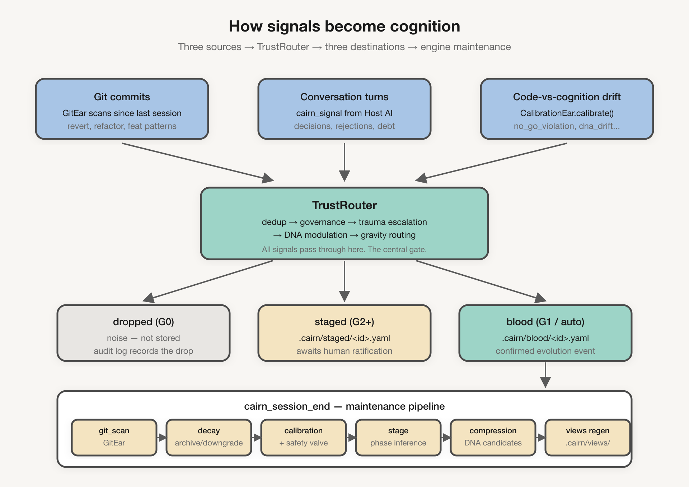

[English](README.md) | 中文

<div align="center">


<h1>Cairn</h1>

<p><strong>软件项目不是一堆代码。它是一个路径依赖的认知生命体。</strong></p>

<p>Cairn 是把这个生命体的认知,在 AI 一次次会话之间,保持鲜活的那一层 MCP。</p>

<p>
  <a href="https://github.com/zzf2333/Cairn/stargazers"></a>
  <a href="https://www.npmjs.com/package/cairn-mcp-server"></a>
  <a href="LICENSE"></a>
  
</p>

</div>

---

> **本文档是中文总览。所有详细设计文档以英文为权威版本。**
> 项目最初的中文设计稿与架构思想保留在仓库本地 `docs/internal/*.zh.md`,作为英文文档的 source-of-intent。

---

代码越来越便宜(AI 在写),真正稀缺的是 **长期稳定的工程认知** —— 团队过去的判断、教训、踩过的坑。没有这个,AI 会一次又一次推荐六个月前刚被拒绝的方案;事故级别的决策因为没人记得而被重新讨论;同一道墙被撞穿两次。

Cairn 抵抗这种 "认知坍塌"。它把项目看作一个有 **骨骼**(skeleton 域结构)、**血液**(blood 演化事件)、**DNA**(emerged 项目人格)、**毛细血管**(capillaries 域细节)、**引力**(gravity 决策权重)、**治理**(governance 人工裁决梯子)的活体。宿主 AI 是过客;Cairn 是留下来的那个。

---

## Cairn 给 AI 的 14 个工具

Cairn 通过 MCP 给宿主 AI 暴露 14 个工具。其中两个是每次会话必走的,其余是队列管理和维护。

| 工具 | AI 何时调用 | 干什么 |
|------|-----------|--------|
| `cairn_context` | 任务开始 / 切换文件时 | 激活当前域的认知、约束、挑战 |
| `cairn_plan` | 做设计 / 架构工作前 | 拉取本任务相关的历史约束 + DNA 指引 |
| `cairn_signal` | 检测到决策 / 拒绝 / 约束时 | 经 TrustRouter 路由,记入治理日志 |
| `cairn_session_end` | 会话结束并带摘要 | 扫 git → 衰减 → 校准 → 阶段推断 → DNA 压缩 |
| `cairn_status` | 会话中查看健康度 | 给出 blood / staged / DNA / phase 快照 |
| `cairn_stage_list` | 看待审事件 | 列出待人工裁决的 staged 演化候选 |
| `cairn_stage_accept` | 通过事件候选 | 转入 blood,执行阶段切换,写审计 |
| `cairn_stage_reject` | 拒绝事件候选 | 拒收条目,写治理日志 |
| `cairn_dna_list` | 看待审 DNA | 列出压缩出的特质候选 |
| `cairn_dna_accept` | 通过特质 | 写入 identity,重新生成视图 |
| `cairn_dna_reject` | 拒绝特质 | 在 staged 中标记拒绝 |
| `cairn_init_status` | 启动 / 恢复时 | 检查初始化状态、版本、未完成 session |
| `cairn_init_commit` | 分析完后引导建仓 | 写入初始 config / skeleton / blood / DNA |
| `cairn_doctor` | 排障 *(维护型)* | 一致性检查、衰减执行、复活候选 |

**每次会话必走**:`cairn_context`(开始)+ `cairn_session_end`(结束)。其余都是按需或人工裁决型。

---

## 工作原理(一张图)

<p align="center"></p>

三种信号来源 —— git 提交、对话轮次、代码与认知漂移 —— 都经过 **TrustRouter** 这一个中央闸门,落到三个目的地之一:`dropped`(G0 噪声)、`staged`(待人工裁决)、`blood`(已确认)。会话结束时,维护流水线自动跑:衰减、校准、阶段推断、DNA 压缩、视图重生成。

<p align="center"></p>

继续看:[集成总览](./docs/diagrams/03-integration-overview.png) · [TrustRouter 决策流](./docs/diagrams/06-trust-router-flow.png)。

---

## 3 分钟安装

```bash
# 1. 安装
npm install -g cairn-mcp-server

# 2a. Claude Code —— 编辑 .claude/mcp.json（项目级）或 ~/.claude.json（全局）
#     "mcpServers": { "cairn": { "command": "cairn-mcp-server" } }

# 2b. Codex —— 编辑 ~/.codex/config.toml
#     [mcp_servers.cairn]
#     command = "cairn-mcp-server"

# 3. 打开你的 AI 工具 —— 初始化完全由 AI 驱动
```

不需要手动 `cairn init` —— MCP server 启动时自动创建 `.cairn/` 目录。首次使用时，AI 调用 `cairn_init_status()` 获取结构化引导（分析步骤 + 所有合法枚举值 + 实践建议），分析你的项目，然后通过 `cairn_init_commit({ dry_run: true })` 提交初始认知供你审核。

可选：把协议文件（`skills/claude-code/SKILL.md` 或 `skills/codex.md`）追加到项目的 `CLAUDE.md` / `AGENTS.md`，以强化日常会话的约束执行力。

完整步骤：[`docs/v-intervene/enter.md`](./docs/v-intervene/enter.md)。

### 当前支持的宿主

| 宿主 | 协议文件 | 状态 |
|------|----------|------|
| **Claude Code** | [`skills/claude-code/SKILL.md`](./skills/claude-code/SKILL.md) | 一线 |
| **Codex** | [`skills/codex.md`](./skills/codex.md) | 一线 |

其他 MCP 兼容宿主(Cline、Windsurf、Cursor、Copilot、Gemini CLI、OpenCode)在 1.x 路线图上。0.4.1 把它们的 adapter 移除,集中精力让两个支持平台到位 —— 等到每个新平台都能通过和 Claude Code / Codex 同样严格的反向回归测试,再加回来。

---

## 一次会话的流向

```
cairn_init_status  →  cairn_context  →  [实际工作]  →  cairn_signal (×N)  →  cairn_session_end
   一次性             每个任务           AI 写码         检测到决策时         维护流水线
```

AI 自己跑的三种典型流:

- **新任务** —— `cairn_context` 激活约束 → AI 写码 → 通过 `cairn_signal` 标一个决策 → `cairn_session_end` 压缩。
- **设计评审** —— `cairn_plan` 浮出历史尝试 → AI 只提没试过的路径。
- **人工裁决** —— `cairn_stage_list`(你看)→ `cairn_stage_accept` / `cairn_stage_reject` → blood 更新。

---

## `.cairn/` 里到底有什么

Cairn 写的是普通 YAML —— 你能读、能 diff、能 git track。一切都不出本机。

| 文件 | 内容 |
|------|------|
| `.cairn/config.yaml` + `state.yaml` | 认知模式、版本、上次 session checkpoint |
| `.cairn/skeleton/` | 域结构(路径、负责人) |
| `.cairn/blood/` | 已确认的演化事件 —— 决策、拒绝、tradeoff |
| `.cairn/dna/` | 涌现出的项目特质(如 `simplicity_bias`) |
| `.cairn/staged/` | 待你裁决的候选 |
| `.cairn/views/output.md` | 给人读的自动摘要 —— 想看一眼就看这个 |

**不写**:源码内容、token、凭证、`.cairn/` 之外的任何东西。
**建议**:把 `.cairn/` 提交进 git。它是项目记忆的一部分。

---

## CLI

| 命令 | 何时用 | 干什么 |
|------|--------|--------|
| `cairn init [--empty]` | 可选 —— 预创建脚手架 | 生成 `.cairn/` 目录（MCP server 启动时会自动创建） |
| `cairn status` | 快速看一眼 | 认知状态快照 |
| `cairn doctor [--fix\|--recover\|--metrics]` | 感觉不对劲 | 一致性、自动复活、修复 |
| `cairn review` | 看待审队列 | 列出待裁决条目 |
| `cairn audit` | 治理审计 | 显示审计日志 |
| `cairn dna show \| list \| accept \| reject \| reevaluate` | DNA 特质管理 | 查看或裁决特质 |
| `cairn skeleton show` | 域结构检查 | 打印骨架树 |
| `cairn blood list \| show \| archive \| resurrect \| trauma` | 事件级操作 | 管理单条演化事件 |
| `cairn stage confirm \| list \| accept \| reject` | 事件裁决 | 处理 staged 队列 |
| `cairn migrate` | 升级后 | 打 cairn_version、执行待迁移 |

完整命令:`cairn --help`。

---

## 六卷文档

完整文档入口:[`docs/0-enter.md`](./docs/0-enter.md)。六卷,推荐第一次按顺序读完。

| 卷 | 内容 | 适合谁 |
|----|------|--------|
| **[i. 起源](./docs/i-origin/)** | 为什么存在 | 想先看哲学(10 分钟) |
| **[ii. 解剖](./docs/ii-anatomy/)** | 器官 —— 骨骼 / 血液 / DNA / 毛细血管 / 引力 / 治理 | 想看架构地图(20 分钟) |
| **[iii. 生命](./docs/iii-life/)** | 生命周期 —— 捕获、衰减、复活、压缩、创伤 | 关心认知如何老化(15 分钟) |
| **[iv. 自反](./docs/iv-self/)** | 自检 —— TrustRouter / 校准 / 安全阀 | 想知道它怎么校准自己(10 分钟) |
| **[v. 介入](./docs/v-intervene/)** | 安装 / AI 协议 / 维护 | 只想用起来(5 分钟) |
| **[vi. 坐标](./docs/vi-coordinates/)** | schema / glossary / stability / performance / migration | 用到了再查 |

**三条阅读路径**:
- **哲学派** → `0-enter` → `i. 起源` → `ii. 解剖`
- **工程派** → `0-enter` → `ii. 解剖` → `vi. 坐标`
- **操作派** → `0-enter` → `v. 介入` → 上面的 CLI 表

如果只有十分钟,先读 [`0-enter.md`](./docs/0-enter.md),再读 [`i-origin/cognitive-collapse.md`](./docs/i-origin/cognitive-collapse.md)。

---

## 为什么做 Cairn

我一次又一次看到 AI 提议项目其实早就试过并拒绝过的方案 —— 有时是三个月前的决定,有时是上周的。AI 没有错,是项目没有可以递给它的记忆。

Cairn 就是那一层"记得"。

---

## 参与开发

- Issue / PR:https://github.com/zzf2333/Cairn
- 引擎层开发规则:[`CLAUDE.md`](./CLAUDE.md)
- 发布检查表(贡献者向、仓库本地):见 `docs/internal/`

---

## License

MIT
