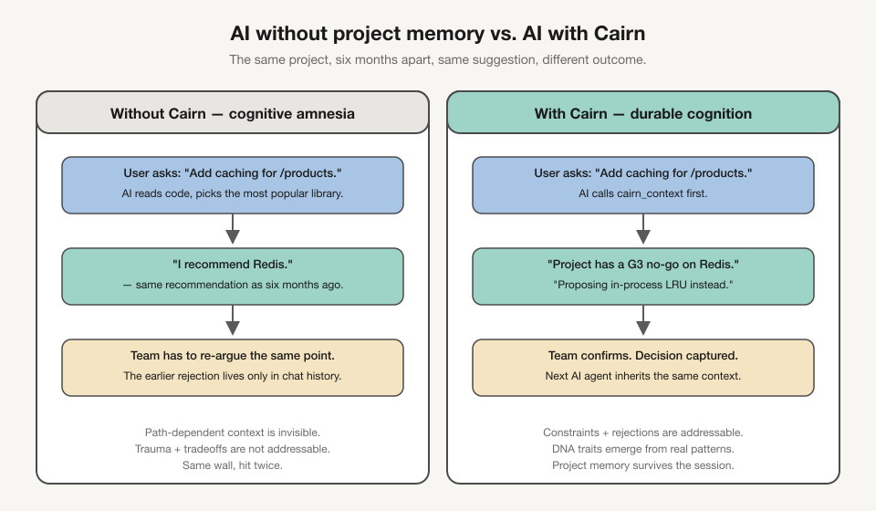
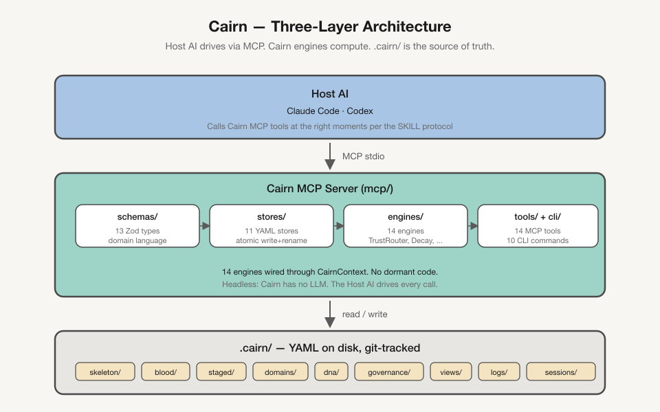
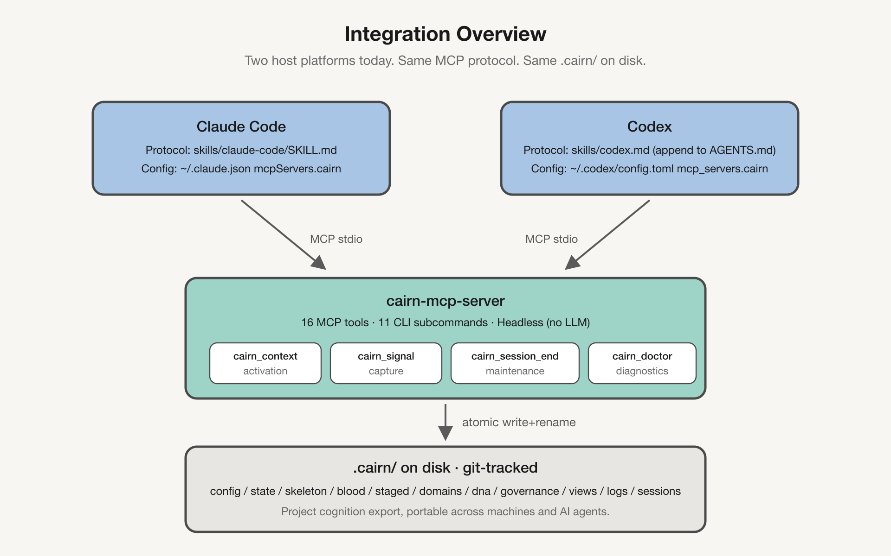

English | [中文](README.zh.md)

<div align="center">


<h1>Cairn</h1>

<p><strong>让你的 AI 拥有一位在项目工作了两年的同事的上下文。</strong></p>

<p>
  <a href="https://github.com/zzf2333/Cairn/stargazers"></a>
  <a href="https://www.npmjs.com/package/cairn-mcp-server"></a>
  <a href="LICENSE"></a>
  
  
</p>

</div>

---

Cairn 将项目的历史决策、被拒路径和已接受的权衡取舍，组织成一种三层格式，供 AI 编程助手自动读取——让 AI 在你项目的真实约束下工作，而不是凭空给出建议。

---

## 问题所在

你的项目已运行 18 个月。第 7 个月，你从 Redux 迁移到了 Zustand——两人团队的模板代价实在太高。第 11 个月，你尝试了 tRPC，与现有 REST 客户端集成出现问题后回滚了。这两个决策都没有记录在任何地方，只存在于你的记忆中。

今天，你打开了一个新的 AI 会话来重构一个模块。

> **AI 建议 #1：** 使用 Redux Toolkit。
> **AI 建议 #2：** 将 API 层迁移到 tRPC。

如果不了解项目历史，这两个建议都很合理。你花了 10 分钟解释哪些方案已经被排除。下周，相同的会话，相同的循环。

这不是模型能力的问题。Claude、GPT、Gemini——它们都足够聪明。问题在于：它们不知道**这个特定项目已经尝试过什么，以及为什么没有成功。**

每次新会话，AI 都是一位刚刚进入项目的聪明架构师。Cairn 赋予它一位从项目最初就在的同事的项目记忆。



---

## 什么是 Cairn

Cairn 是一个 **AI 路径依赖约束系统**——一种用于记录项目决策、被拒路径和已接受权衡的结构化格式。

它**不是**文档系统。每条记录都必须能改变 AI 的建议。如果某条信息不影响 AI 的行为，它就不属于 Cairn。

Cairn 填补了 AI 工具已经处理得很好的内容之间的空白：

| 工具已处理的内容 | Cairn 补充的内容 |
|----------------|----------------|
| 编码风格、命名规范 | 被拒路径及原因 |
| 当前技术栈与架构 | 阶段感知约束（MVP 阶段 vs. 增长阶段） |
| 正在构建的内容 | 不应触碰的已接受技术债 |
| 如何编写代码 | 已经走过的路径 |

---

## 工作原理

Cairn 在你的代码库根目录使用一个三层目录：

```
.cairn/
├── output.md          # 第一层：全局约束，每次会话都会读取
├── domains/           # 第二层：域上下文，规划时按需读取
│   ├── api-layer.md
│   └── auth.md
└── history/           # 第三层：原始决策事件，按需精确查询
    ├── 2023-09_trpc-experiment-rejection.md
    └── 2024-01_auth-debt-accepted.md
```



| 层级 | 文件 | AI 读取时机 | Token 预算 |
|------|------|------------|-----------|
| 全局约束 | `.cairn/output.md` | 每次会话，始终读取 | 目标 500 / 最多 800 |
| 域上下文 | `.cairn/domains/*.md` | 规划与设计时 | 每文件 200–400 |
| 决策历史 | `.cairn/history/*.md` | 按需精确查询 | 不限 |

**运行时流程：**
1. AI 在会话开始时读取 `output.md`——建立禁区方向和当前项目阶段
2. 规划功能时，AI 读取相关域文件——了解该领域的演进历史和已知陷阱
3. 需要完整历史细节时，AI 查询 `history/`——包含被拒替代方案的原始决策事件

### 三种约束类型

三个概念产生不同的 AI 行为变化：

| 概念 | 含义 | AI 行为 |
|------|------|--------|
| **no-go（禁区方向）** | 已评估并排除的方向 | 绝不建议 |
| **accepted debt（已接受的技术债）** | 已知缺陷，故意保留 | 绝不尝试修复 |
| **known pitfalls（已知陷阱）** | 特定域中的操作陷阱 | 主动规避触发条件 |

---

## 实现方式

Cairn 是一种**纯文件格式**——不需要运行时、后台进程或外部服务。`.cairn/` 目录是具有定义结构的纯 Markdown 文件，与代码一起进行版本管理。

**第一层（`output.md`）：** 五个必需的 YAML 标题章节（`stage`、`no-go`、`hooks`、`stack`、`debt`）。硬限制为 800 tokens。AI 在每次回复前都会读取它。

**第二层（域文件）：** 带有 `hooks` 关键词列表的 YAML 前置元数据，用于意图检测，后跟 no-go 规则、已知陷阱和演进历史的 Markdown 章节。**整体覆盖式更新**，不追加——原始事件保留在 `history/`。

**第三层（历史文件）：** 裸 `key: value` 格式（无 YAML fences）。每个文件是一个决策事件，包含字段：`type`、`domain`、`summary`、`rejected`、`chosen`、`reason`、`revisit_when`。`rejected` 字段最为关键——它记录了 AI 最可能重新提出的路径。

**行为层（适配文件）：** 每个 AI 工具都有一个 Skill 适配文件，指示它何时以及如何读取 `.cairn/` 各层。数据层工具无关；行为层按工具单独维护以保证语义等价。

---

## 质量保证

**规范驱动：** `spec/FORMAT.md` 是所有三层的权威参考。每个工具、脚本和示例都必须遵循它。有疑问时，以规范为准。

**测试覆盖：**
- Shell 测试套件：**577 个断言**，涵盖 7 个测试文件（CLI、初始化脚本、格式验证）
- MCP Server 测试套件：**100+ 个断言**，涵盖 12 个 Vitest 测试文件（解析器、所有 6 个工具）

**人工审核原则：** MCP `cairn_propose` 工具写入 `.cairn/staged/`——绝不直接写入 `history/`。AI 提议；人工通过移动文件来批准。

---

## 快速开始

### 安装

**方案 A：交互式初始化脚本（推荐）**

```bash
curl -sL https://raw.githubusercontent.com/zzf2333/Cairn/main/scripts/cairn-init.sh -o cairn-init.sh
chmod +x cairn-init.sh
./cairn-init.sh
```

脚本引导你完成 5 个步骤（约 30 分钟）：
1. 选择项目的域（11 个标准选项）
2. 填写 `output.md`（阶段、no-go 规则、技术栈、已接受技术债）
3. 用一个条目模板初始化 `history/`
4. 初始化 `domains/`（初始为空——这是正常的）
5. 为你的 AI 工具安装 Skill 适配文件

**方案 B：CLI**

```bash
git clone https://github.com/zzf2333/Cairn
ln -s "$(pwd)/Cairn/cli/cairn" /usr/local/bin/cairn
cairn init    # 交互式，委托给 cairn-init.sh
```

需要 Bash 3.2+（macOS 系统自带的 bash 即可）。

**方案 C：仅 MCP Server**

```bash
# 通过 npm 安装
npm install -g cairn-mcp-server

# 或从源码安装
git clone https://github.com/zzf2333/Cairn
cd Cairn/mcp && npm install && npm run build
```

需要 Node.js 18+。

---

### 日常使用

```bash
# 显示三层摘要并检测需更新的域文件
cairn status

# 记录新决策事件（交互式）
cairn log

# 记录拒绝事件（标志模式）
cairn log --type rejection --domain api-layer \
    --summary "Rejected GraphQL after evaluation" \
    --rejected "GraphQL: data complexity doesn't justify it" \
    --reason "Current team size makes GraphQL overhead unwarranted" \
    --revisit-when "Frontend needs regular cross-resource aggregation"

# 生成刷新需更新域文件的提示词
cairn sync api-layer
cairn sync --stale          # 一次处理所有需更新的域
cairn sync api-layer --copy # 将提示词复制到剪贴板
```

**过期检测：** `cairn status` 对比每个域文件的 `updated:` 前置元数据与历史条目的 `recorded_date`。当新历史条目在域文件最后更新后被添加时，该域被标记为需更新：

```
$ cairn status

stage:   early-growth (2024-09+)
domains: 3 active, 1 not created

⚠  api-layer   last updated 2024-03 · 2 new history entries since
               run: cairn sync api-layer

✓  auth        up to date (2024-06)
✓  state-management  up to date (2024-03)
·  database    not yet created (0 history entries)

history: 4 entries total
```

---

### 更新

**初始化脚本 / CLI：**
```bash
cd /path/to/Cairn && git pull
# Symlink 仍然有效——无需重新安装
```

**MCP Server（npm）：**
```bash
npm install -g cairn-mcp-server@latest
```

**MCP Server（从源码）：**
```bash
cd /path/to/Cairn && git pull
cd mcp && npm install && npm run build
# 下次重启服务器时自动使用新构建
```

**Skill 适配文件：** 重新运行 `cairn-init.sh` 并选择重新安装适配文件，或从 `skills/` 手动复制更新后的文件到 AI 工具的对应位置。

---

### 卸载

**CLI：**
```bash
rm /usr/local/bin/cairn   # 移除符号链接
# 可选：rm -rf /path/to/Cairn
```

**MCP Server：**
```bash
npm uninstall -g cairn-mcp-server
# 从 MCP 设置文件中移除 "cairn" 块
# （Claude Code：~/.claude/settings.json 或 .claude/settings.json）
```

**Skill 适配文件：**
删除安装时复制的适配文件（参见下方支持的 AI 工具表格）。

**项目数据（`.cairn/`）：**
`.cairn/` 目录属于你的项目仓库。移除 Cairn 工具不会删除它——如需移除，请手动删除，或将其保留为文档。

---

## MCP Server

MCP Server（Phase 3）将 Cairn 从文件注入升级为类型化工具调用。它公开六个精确的工具，将 AI 意图与域前置元数据的 `hooks` 字段进行匹配，而无需依赖 AI 工具自行推断何时加载上下文。



### 工具列表

| 工具 | 描述 |
|------|------|
| `cairn_output` | 读取 `.cairn/output.md`——第一层全局约束 |
| `cairn_domain` | 读取 `.cairn/domains/<name>.md`——第二层域上下文 |
| `cairn_query` | 搜索 `.cairn/history/`——第三层事件，支持域/类型过滤 |
| `cairn_match` | 将关键词与域 `hooks` 匹配——精确意图检测 |
| `cairn_propose` | 将历史条目草稿写入 `.cairn/staged/` 供人工审核 |
| `cairn_sync_domain` | 生成用于重新生成需更新域文件的上下文 |

### 配置

**Claude Code** — 添加到 `~/.claude/settings.json`：
```json
{
    "mcpServers": {
        "cairn": {
            "command": "node",
            "args": ["/path/to/Cairn/mcp/dist/index.js"]
        }
    }
}
```

**Cursor** — 添加到项目中的 `.cursor/mcp.json`：
```json
{
    "mcpServers": {
        "cairn": {
            "command": "node",
            "args": ["/path/to/Cairn/mcp/dist/index.js"]
        }
    }
}
```

服务器通过从 `process.cwd()` 向上遍历来解析 `.cairn/`，或者通过 `CAIRN_ROOT` 环境变量来固定到特定项目。

详细配置选项和推荐 AI 工作流程，请参阅 [`mcp/README.md`](mcp/README.md)。

---

## 支持的 AI 工具

| 工具 | 适配文件 | 安装位置 |
|------|---------|---------|
| Claude Code | `skills/claude-code/SKILL.md` | `.claude/skills/cairn/SKILL.md` |
| Cursor | `skills/cursor.mdc` | `.cursor/rules/cairn.mdc` |
| Cline / Roo Code | `skills/cline.md` | `.clinerules`（追加） |
| Windsurf | `skills/windsurf.md` | `.windsurfrules`（追加） |
| GitHub Copilot | `skills/copilot-instructions.md` | `.github/copilot-instructions.md`（追加） |
| Codex CLI | `skills/codex.md` | `AGENTS.md`（追加） |
| Gemini CLI | `skills/gemini-cli.md` | `GEMINI.md`（追加） |
| OpenCode | `skills/opencode.md` | `AGENTS.md`（追加，与 Codex 共享） |

`cairn-init.sh` 自动处理所有八个工具的安装。

数据层（`.cairn/`）完全工具无关——随项目仓库一起传递。行为层（Skill 适配文件）按工具单独维护，以保证语义等价。

---

## 示例

[`examples/saas-18mo/`](examples/saas-18mo/) 是一个来自 18 个月 SaaS 项目的完整三层示例——与本文档开头故事中的项目相同：

- `output.md`——阶段 `early-growth`、no-go 规则（tRPC、Redux、Kubernetes）、当前技术栈、已接受技术债
- 三个域文件：`api-layer`、`auth`、`state-management`
- 四个历史事件：状态管理迁移、tRPC 拒绝、auth 技术债接受、成长阶段过渡

---

## 文档

| 文档 | 内容 |
|------|------|
| [`spec/FORMAT.md`](spec/FORMAT.md) | 三层完整格式参考（权威文档） |
| [`spec/DESIGN.md`](spec/DESIGN.md) | Cairn 的设计理念与原因 |
| [`spec/vs-adr.md`](spec/vs-adr.md) | Cairn 与架构决策记录（ADR）的关系 |
| [`spec/adoption-guide.md`](spec/adoption-guide.md) | Init 和响应式采用分步指南 |
| [`mcp/README.md`](mcp/README.md) | MCP Server 配置与工具参考 |
| [`CHANGELOG.md`](CHANGELOG.md) | 版本历史 |

---

## 许可证

MIT
