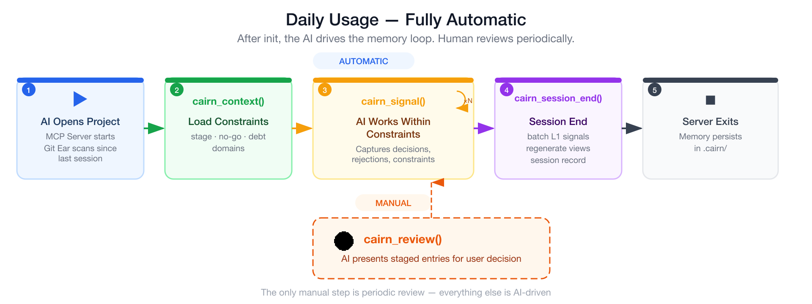

English | [中文](README.zh.md)

<div align="center">


<h1>Cairn</h1>

<p><strong>让你的 AI 拥有一位在项目工作了两年的同事的上下文。</strong></p>

<p>
  <a href="https://github.com/zzf2333/Cairn/stargazers"></a>
  <a href="https://www.npmjs.com/package/cairn-mcp-server"></a>
  <a href="LICENSE"></a>
  
</p>

</div>

---

Cairn 是一个 AI 原生的工程认知引擎。它从 Git 历史和 AI 对话中捕获项目决策、被拒路径和
已接受的权衡取舍，通过基于重力的信任系统路由，并提供结构化约束供 AI 编程助手作为行为护栏消费。

---

## 问题所在

你的项目已运行 18 个月。第 7 个月，你从 Redux 迁移到了 Zustand——两人团队的模板代价实在太高。
第 11 个月，你尝试了 tRPC，与现有 REST 客户端集成出现问题后回滚了。这两个决策都没有记录在
任何地方，只存在于你的记忆中。

今天，你打开了一个新的 AI 会话来重构一个模块。

> **AI 建议 #1：** 使用 Redux Toolkit。
> **AI 建议 #2：** 将 API 层迁移到 tRPC。

如果不了解项目历史，这两个建议都很合理。你花了 10 分钟解释哪些方案已经被排除。下周，相同的
会话，相同的循环。

这不是模型能力的问题。Claude、GPT、Gemini——它们都足够聪明。问题在于：它们不知道**这个特定
项目已经尝试过什么，以及为什么没有成功。**

每次新会话，AI 都是一位刚刚进入项目的聪明架构师。Cairn 赋予它一位从项目最初就在的同事的
项目记忆。


---

## 什么是 Cairn

Cairn 是一个 **AI 原生的工程认知引擎**——它捕获、路由、存储和提供项目约束，
让 AI 在项目的真实历史中工作，而不是凭空给出建议。

| AI 工具已处理的内容 | Cairn 补充的内容 |
|-------------------|----------------|
| 编码风格、命名规范 | 被拒路径及原因 |
| 当前技术栈与架构 | 阶段感知约束（MVP 阶段 vs. 增长阶段） |
| 正在构建的内容 | 不应触碰的已接受技术债 |
| 如何编写代码 | 已经走过的路径 |

---

## 架构

Cairn V3 基于六个核心子系统构建：

| 子系统 | 角色 |
|--------|------|
| **Skeleton（骨架）** | 域所有权映射——哪个模块拥有什么、稳定性级别、因果关键词 |
| **Blood（血液）** | 演化事件——每个决策、否决、迁移和技术债接受 |
| **DNA** | 涌现的项目个性——从重复模式中压缩出的特质 |
| **Capillaries（毛细血管）** | 按域的约束投影——约束、被拒路径、已接受债务 |
| **Gravity（重力）** | 信号权重系统（G0–G3），替代 V2 的 L0–L3 信任级别 |
| **Governance（治理）** | 三级验证：agent_proposed、system_validated、human_ratified |

### 工作原理

Cairn 从两个来源捕获项目信号，通过基于重力的信任系统路由，并将结果作为结构化约束提供。


**信号捕获：**
- **Git 耳朵**检测回滚、依赖变更、大规模重构、commit 模式
- **对话耳朵**捕获用户否决、决策、约束、债务接受
- **校准耳朵**检测骨架漂移、一致性冲突、DNA 漂移警告

**重力系统（G0–G3）：**
- **G0 丢弃** — 噪声或重复，直接丢弃
- **G1 建议** — 低权重信号，存储备用
- **G2 反思性挑战** — 足以挑战 AI 的假设
- **G3 硬约束** — 必须遵守，没有例外

**Blood → Views → 约束：**
- `blood/` 存储演化事件（结构化 YAML，git diff 友好）
- `views/` 是自动生成的（token 预算感知的 Markdown，供 AI 消费）
- AI 调用 `cairn_context()` 获取当前任务的过滤约束


### 认知模式

Cairn 根据项目需求调整行为强度：

| 模式 | 治理阈值 | 衰减 | 适用场景 |
|------|---------|------|---------|
| `lightweight` | 仅 G3 | 激进（30/60 天） | 个人项目、实验 |
| `standard` | G2+ | 适中（90/120 天） | 小型团队、大多数项目 |
| `institutional` | G1+ | 保守（180/240 天） | 大型团队、受监管行业 |

### 四种约束行为

每个演化事件声明一个 `behavior_effect`：

| 类型 | AI 行为 |
|------|--------|
| `avoid_suggestion` | AI 不得建议此方向 |
| `prefer_approach` | AI 应优先采用此方案 |
| `warn_before` | AI 在触及此区域前应发出警告 |
| `require_review` | 此区域的变更需要人工确认 |

---

## 快速开始

### 安装

需要 Node.js 18+。

```bash
npm install -g cairn-mcp-server
```

<details>
<summary>从源码安装</summary>

```bash
git clone https://github.com/zzf2333/Cairn
cd Cairn/mcp && npm install && npm run build
```

</details>

### 安装完成

安装时会自动将 MCP 服务器注册到检测到的 AI 工具（Claude Code、Cursor、Windsurf、Claude Desktop）。
无需手动配置。

Cairn 采用两阶段初始化：AI 先调用 `cairn_init_status()` 检查项目状态，分析代码库，
然后调用 `cairn_init_commit()` 写入初始认知（骨架、血液事件、DNA 特质、阶段）。

<details>
<summary>手动 MCP 配置</summary>

如果自动安装未检测到你的工具，手动添加以下配置：

```json
{
    "mcpServers": {
        "cairn": { "command": "cairn-mcp-server" }
    }
}
```

配置文件位置：
- **Claude Code** — `~/.claude/mcp.json`
- **Cursor** — `~/.cursor/mcp.json`
- **Claude Desktop** — `~/Library/Application Support/Claude/claude_desktop_config.json`（macOS）

</details>

<details>
<summary>手动初始化（可选）</summary>

如果需要手动创建 `.cairn/` 目录结构：

```bash
cd my-project
cairn init --empty
```

这会创建一个空的 `.cairn/` 脚手架。AI 会在首次 `cairn_init_commit()` 时填充内容。

</details>

---

## 日常使用

MCP 配置完成后，日常操作完全自动：

1. **会话开始** — AI 调用 `cairn_context()` 激活相关认知
2. **工作过程中** — AI 检测到决策、否决或约束时调用 `cairn_signal()`
3. **会话结束** — AI 调用 `cairn_session_end()` 处理信号并重新生成视图

唯一需要人工操作的：AI 提示有待审条目时进行审核。



---

## MCP 工具

| 工具 | 用途 | 稳定性 |
|------|------|--------|
| `cairn_init_status` | 检查初始化状态 | 稳定 |
| `cairn_init_commit` | 项目分析后批量写入初始认知 | 稳定 |
| `cairn_context` | 为当前任务激活相关认知 | 稳定 |
| `cairn_signal` | 报告决策、否决、约束 | 稳定 |
| `cairn_session_end` | 会话结束批量处理 | 稳定 |
| `cairn_status` | 系统状态概览 | 稳定 |
| `cairn_plan` | 历史感知规划框架 | 稳定 |
| `cairn_stage_list` | 列出待审的暂存条目 | 稳定 |
| `cairn_stage_accept` | 接受暂存条目到血液 | 稳定 |
| `cairn_stage_reject` | 拒绝暂存条目 | 稳定 |
| `cairn_doctor` | 认知一致性校验 | 稳定 |

完整工具 Schema 和推荐工作流程见 [`mcp/README.md`](mcp/README.md)。

---


## 支持的 AI 工具

### MCP（主要路径）

| 工具 | 配置位置 |
|------|---------|
| Claude Code | `~/.claude/mcp.json` 或 `.claude/mcp.json` |
| Cursor | `.cursor/mcp.json` |
| Claude Desktop | `~/Library/Application Support/Claude/claude_desktop_config.json` |
| Cline / Roo Code | `~/Documents/cline/cline_mcp_settings.json` |
| Windsurf | `~/.codeium/windsurf/mcp_config.json` 或 `.windsurf/mcp_config.json` |
| GitHub Copilot | `.vscode/mcp.json` |
| Codex CLI | `~/.codex/config.toml` 或 `.codex/config.toml` |
| Gemini CLI | `~/.gemini/settings.json` 或 `.gemini/settings.json` |
| OpenCode | `~/.config/opencode/opencode.json` 或 `opencode.json` |

### Skill 适配文件（备选路径）

未配置 MCP 时，可通过 Skill 适配文件直接注入 `views/` 内容：

| 工具 | 适配文件 | 安装位置 |
|------|---------|---------|
| Claude Code | `skills/claude-code/SKILL.md`（规范版） | `.claude/CLAUDE.md`（追加） |
| Cursor | `skills/cursor.mdc` | `.cursor/rules/cairn.mdc` |
| Cline / Roo Code | `skills/cline.md` | `.clinerules`（追加） |
| Windsurf | `skills/windsurf.md` | `.windsurfrules`（追加） |
| GitHub Copilot | `skills/copilot-instructions.md` | `.github/copilot-instructions.md`（追加） |
| Codex CLI | `skills/codex.md` | `AGENTS.md`（追加） |
| Gemini CLI | `skills/gemini-cli.md` | `GEMINI.md`（追加） |
| OpenCode | `skills/opencode.md` | `AGENTS.md`（追加） |

数据层（`.cairn/`）完全工具无关——随项目仓库一起传递。

---

## CLI

```
cairn <command> [options]

命令:
  init [--empty]           初始化 .cairn/ 目录
  status                   查看项目认知状态
  doctor                   运行一致性检查和健康诊断
  review                   列出待审暂存条目
  audit                    查看治理审计日志
  dna show                 查看 DNA 特质
  dna reevaluate           触发 DNA 重新评估
  skeleton show            查看骨架节点
  blood show [id]          查看血液事件
  blood archive <id>       归档一个血液事件
  blood resurrect <id>     复活一个已归档事件
  blood trauma <id>        将事件标记为创伤
  stage confirm            确认阶段建议为正式状态

选项:
  --version                查看版本
```

---

## 阶段建议引擎

Cairn 从 Git 信号自动推断项目生命周期阶段：

| 阶段 | 典型信号 | 引导效果 |
|------|---------|---------|
| `exploration` | 项目年龄 < 6 个月，依赖变动频繁 | 允许新依赖，鼓励实验，优先验证速度 |
| `growth` | 提交趋势上升，依赖趋于稳定 | 平衡速度与稳定性 |
| `maturity` | 新文件占比低，项目年龄 > 18 个月 | 新依赖需要充分理由 |
| `maintenance` | 提交频率下降，项目年龄 > 24 个月 | 仅限保守变更 |

引擎**仅作建议** — 不会自动施加硬约束。
阶段引导在 confidence >= 0.5 时通过 `cairn_context()` 呈现。要确认阶段为正式状态，
使用 `cairn stage confirm` 或通过 AI 中介的 `cairn_stage_accept`。

---

## `.cairn/` 目录结构

```
.cairn/
├── config.yaml              # 项目配置：名称、域列表、认知模式、技术栈
├── state.yaml               # 运行时状态：上次会话、阶段快照
├── skeleton/                # 域所有权映射（每域一个 YAML）
│   ├── frontend.yaml
│   └── backend.yaml
├── blood/                   # 演化事件（决策、否决、迁移）
│   ├── evt_001.yaml
│   └── evt_002.yaml
├── dna/                     # 涌现的项目个性
│   ├── identity.yaml        # 当前 DNA 特质
│   └── imprint.yaml         # 继承的约束（用于 fork 项目）
├── domains/                 # 按域的毛细血管投影
│   ├── frontend/
│   │   ├── constraints.yaml
│   │   ├── accepted_debt.yaml
│   │   └── rejected_paths.yaml
│   └── backend/
├── staged/                  # 等待人工审核的条目
├── signals/                 # 原始捕获的信号
│   ├── raw_git/
│   ├── raw_conversation/
│   └── raw_calibration/
├── governance/              # 治理策略和审计日志
│   ├── policy.yaml
│   └── audit.yaml
├── views/                   # 自动生成的 markdown 投影
│   ├── output.md            # 全局约束摘要
│   ├── stage.md             # 阶段建议详情
│   └── domains/             # 按域摘要
├── sessions/                # 会话审计记录
```

---

## 示例

- [`examples/saas-18mo/`](examples/saas-18mo/) — 18 个月 SaaS 项目
  （阶段 `growth`、no-go：tRPC/Redux、3 个域、4 个血液事件）

---

## 文档

| 文档 | 内容 |
|------|------|
| [`spec/FORMAT.md`](spec/FORMAT.md) | 所有 `.cairn/` 数据文件的完整 Schema 参考 |
| [`spec/DESIGN.md`](spec/DESIGN.md) | 设计理念：信号捕获、重力系统、阶段引擎、Blood/Views 分离 |
| [`spec/vs-adr.md`](spec/vs-adr.md) | Cairn 与架构决策记录（ADR）的关系 |
| [`spec/adoption-guide.md`](spec/adoption-guide.md) | 安装与日常使用指南 |
| [`spec/glossary.md`](spec/glossary.md) | 术语参考 |
| [`mcp/README.md`](mcp/README.md) | MCP Server 工具 Schema 和配置 |
| [`CHANGELOG.md`](CHANGELOG.md) | 版本历史 |

---

## 许可证

MIT
